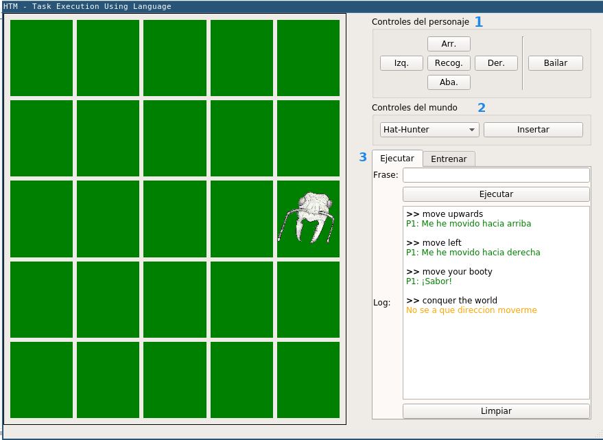

# Table of Contents

* [Description](#description)
* [Requirements](#requirements)
* [Usage](#usage)
  * [Download the source code](#download-the-source-code)
  * [Run it](#run-it)
  * [Features Overview](#features-overview)
* [The Encoders](#the-encoders)
  * [Custom Category Encoder](#custom-category-encoder)
  * [Randomized Letter Encoder](#randomized-letter-encoder)
  * [Totally Random Encoder](#totally-random-encoder)
* [Contact](#contact)

# Description
HTM-TEUL is an experiment to evaluate the use of the HTM theory on Natural 
Language Processing. TEUL stands for Task Execution Using Language. The
software allows you to give sentences in spanish or english in order to
execute a task in a virtual, controlled environment. You can find the data
used to train the learning system in Learning/Data.

I presented this project as my undergraduate "thesis". You may find the full text (in spanish) in my [ResearchGate](https://www.researchgate.net/publication/305114878_Desarrollo_de_un_modelo_HTM_para_la_ejecucion_de_tareas_utilizando_el_lenguaje_natural?ev=prf_pub).

# Requirements
* [Python 2.7](https://www.python.org/downloads/)
* [Nupic](https://github.com/numenta/nupic) (Tested with v. 0.3.6 and v. 0.5.0)
* [PyQt5](https://www.riverbankcomputing.com/software/pyqt/download5)
* [PyramsFinder](https://github.com/larvasapiens/PyramsFinder) (Included in Utils/)

# Usage

## Download the source code:

You may download the HTM-TEUL's source coude through the 'Clone or download' button at the github page, or by issuing this in your command prompt (note that you must have git installed for this method to work):

```
git clone https://github.com/larvasapiens/htm-teul 
```
## Run it

Open a command prompt in the HTM-TEUL source code folder and issue

```
python main.py
```
Note that in some systems (like Arch Linux) python is associated with python 3, so you must explicitely run python2 instead of just python.

HTM-TEUL can receive some command-line argumments, which are described above:

```
HTM-TEUL Help:
  OPTIONS:
    -h | --help: To show this help
    -d | --dataset: Can be 'Total'*, 'Partial', 'Spanish' or 'English'
    -e | --encoder: Can be 'rle', 'tre' or 'cce'*
    -m | --model: Can be 'Classic', 'OneLevel'* or 'Feedbackgv
    -i | --iterations: Number of times the training data will be passed to the
        model. Must be an integer (default=30).
    -t | --tests: Run the TestSuite.
    -s | --save: Save the trained model. Note that the resulting files can be 
heavy (around 50mb).
    --no-gui: Do not display gui

Test results and saved models will be stored in Reults/ folder.
*=default
```

## Features overview

The first thing that occurs when you run HTM-TEUL is the model training. Depending on the data set and number of iterations you choose, this could take several minutes (if you save your model, you can later reload it with the LoadModel.py utility so you don't need to train it again). In general, more iterations means more accuracy, but I've found that, for this application, around 20 there's some kind of a threshold, where it achieves the maximum accuracy possible for the choosen configuration. After training, the program will show the following gui (unless the *--no-gui* option was selected):



Currently, the gui is only available in spanish. At the left side you'll encounter the virtual world, in which you'll be able to see the tasks being executed by our cartoonish friend (an *Ectatomma ruidum* ant). To the right is our control panel. Let's take a look at each part, following the numbers that appear in the screenshot:

* **1. Character Controls (Controles del personaje):** Here you can try all the tasks that can be excecuted. These are:
  * Move upwards (Arr.), downwards (Aba.), to the left (Izq.) and to the right (Der.),
  * Pick up an object (Recoger), and of course...
  * Dance (Bailar)
* **2. World Controls (Controles del mundo):** With these you'll be able to make changes in the environment (or virtual world). Currently, you can only put hats in random positions so the character can pick them up.
* **3. Execute (Ejecutar) and Train (Entrenar):** This is the interesting part. Put some text in the Phrase (Frase) field and press enter (or push the "Ejecutar" button). The phrase and some pre-defined response will appear in the log. If the model can associate a task with the phrase, you'll see that task being performed by the character.

The system is not perfect; it might predict incorrect tasks for some phrases that are present in the training set. But it's also robust in the sense that it can correctly predict tasks for partial or "scrambled" phrases. If you're interested in actual numbers, you may find accuracy reports at the Results/ folder, or you can experiment with different parameters and run HTM-TEUL with the -t flag (Note that the new reports will also be saved in the Results/ folder, overriding the existing ones).

# The Encoders

The following are code use examples of the different encoders used in HTM-TEUL

## Custom Category Encoder:

A custom version of the Nupic's Category Encoder. Allows to reserve slots for additional categories at creation time.

```python
encoder = CustomCategoryEncoder(w=3, categoryList=["a", "b"], nAdditionalCategorySlots=1, forced=True)

encoder.encode("a")
#Out (Input in categoryList, previously assigned bits): 
array([0, 0, 0, 1, 1, 1, 0, 0, 0, 0, 0, 0], dtype=uint8)

encoder.encode("z")
#Out (Assigns the reserved slot):
array([0, 0, 0, 0, 0, 0, 0, 0, 0, 1, 1, 1], dtype=uint8)

encoder.encode("c")
#Out (No slots left, assigns <<Unknown>> classification):
array([1, 1, 1, 0, 0, 0, 0, 0, 0, 0, 0, 0], dtype=uint8)
```

## Randomized Letter Encoder:

A bit is assigned to each letter of the word (using a Category Encoder), and then a random string of bits is concatenated.

```python
encoder = RandomizedLetterEncoder(width=60, nRandBits=2, actBitsPerLetter=1)

encoder.encode('le')
# Out (Active bits: 12 ('l'), 32 ('e'), 54 and 57 (random)): 
array([0, 0, 0, 0, 0, 0, 0, 0, 0, 0, 0, 0, 1, 0, 0, 0, 0, 0, 0, 0, 0, 0, 0, 0, 0, 0, 0, 0, 0, 0, 0, 0, 1, 0, 0, 0, 0, 0, 0, 0, 0, 0, 0, 0, 0, 0, 0, 0, 0, 0, 0, 0, 0, 0, 1, 0, 0, 1, 0, 0], dtype=uint8)

encoder.encode('la')
# Out (Active bits: 12 ('l'), 28 ('a'), 55 and 58 (random)): 
array([0, 0, 0, 0, 0, 0, 0, 0, 0, 0, 0, 0, 1, 0, 0, 0, 0, 0, 0, 0, 0, 0, 0, 0, 0, 0, 0, 0, 1, 0, 0, 0, 0, 0, 0, 0, 0, 0, 0, 0, 0, 0, 0, 0, 0, 0, 0, 0, 0, 0, 0, 0, 0, 0, 0, 1, 0, 0, 1, 0], dtype=uint8)
```

## Totally Random Encoder:

A random sequence of bits is assigned to each word.

```python
encoder = TotallyRandomEncoder(width=15, nActiveBits=3)

encoder.encode("a")
#Out (assigned bits): 
array([0, 0, 0, 1, 0, 1, 0, 0, 0, 0, 0, 1, 0, 0, 0], dtype=uint8)

encoder.encode("r")
#Out (assigned bits): 
array([0, 0, 0, 1, 0, 0, 0, 1, 0, 0, 0, 0, 0, 0, 1], dtype=uint8)
```

# Contact
If you have any questions, recommendations, need support, or if you just liked the project, 
I'll be happy to read your emails at sebasnr95@gmail.com

